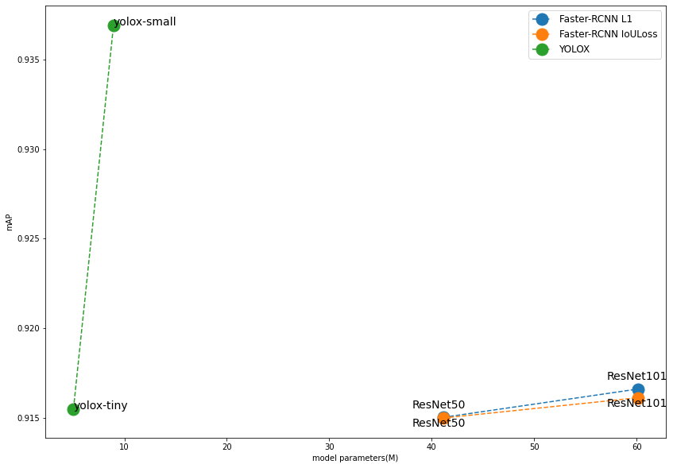
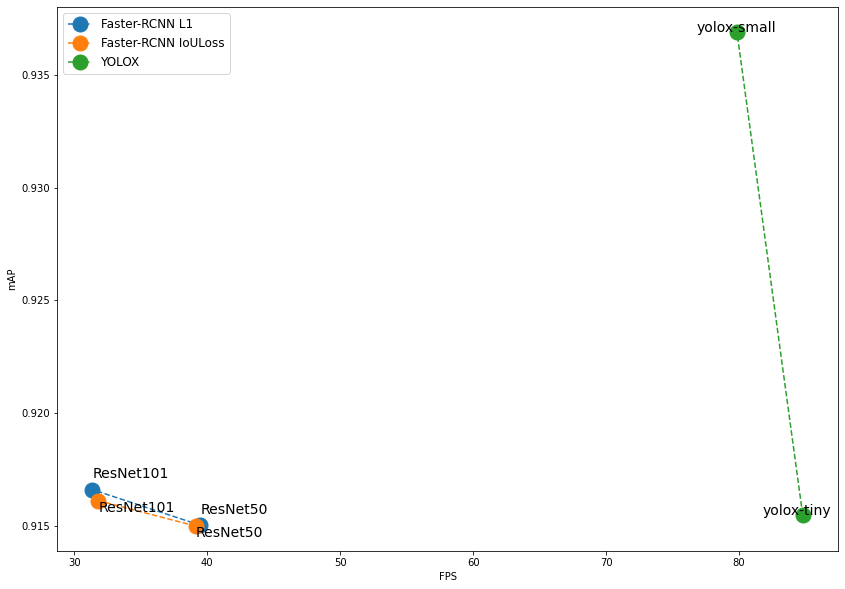

## Installation
It's recommended to create new environment. I used Anaconda environment with Python 3.8.

To install required dependencies run the following commands in created anaconda environment :
```sh
conda install pytorch torchvision cudatoolkit=11.6 -c pytorch -c conda-forge
pip install -U openmim
mim install mmcv-full
conda install -c conda-forge pycocotools
pip install git+https://github.com/open-mmlab/mmdetection.git
conda install -c conda-forge opencv matplotlib tensorboard
conda install -c anaconda jupyter
```

## Preparing data
### Download dataset
Download data from [google drive](https://drive.google.com/file/d/1fHL2yhucxujjFmBz5lwt41ZHisX99t-y/view?usp=sharing) and put it into [data/](./data).
### Prepare annotations
Run [utils/split_data.py](./utils/split_data.py) to prepare train/val/test annotations. Usage:
- `--proportion=<proportion>` -  proportion of the dataset to include in the train split (default is 0.85)
-   `--train_size=<size>` - number of images in train split (all images are used by default)

### Download checkpoints
Download checkpoints from [google drive](https://drive.google.com/file/d/1DmY3LdR8h1p4MqqEzudITmVIfdg1XqKs/view?usp=sharing) and put it into [checkpoints/](./checkpoints).

### Download logs
Download training logs from [google drive](https://drive.google.com/file/d/1_0B-ZaCICUzlGM3bup_AVQMugXr5r3n1/view?usp=sharing) and put it into [logs/](./logs)

## Usage
### Training
To train model run [train.py](./train.py) with arguments:
- `--config=<path to config>` - path to model config
- `--resume_from=<path to checkpoint>` - path to load weights from to resume training (optional)
- `--max_epochs=<number>`       - number of epochs to train (default value is obtained from model config)
- `--work_dir=<path to dir>`    - path to working directory where logs will be saved (default value is obtained from model config)
```sh
python train.py --config=<path to config> [--resume_from=<path to checkpoint>] \
                [--max_epochs=<number>] [--work_dir=<path to dir>]
```

### Testing
To test model run [test.py](./test.py) with arguments:
- `--config=<path to config>` - path to model config
- `--ckpt=<path to checkpoint>` - path to load weights from
- `--imgs_path=<path to dir>` - path to images to test (images from model test data config are tested by default)
- `--show` - whether to show results
- `--show-dir=<path to dir>` - directory where painted images will be saved (will be created)
- `--show-score-thr=<threshold value>` - score threshold to show bounding box (default: 0.3)
- `--out=<path to file>` - file in pickle format for saving output (not saved by default)
```sh
python train.py --config=<path to config> --ckpt=<path to checkpoint> \
                [--imgs_path=<path to dir>] \
                [--show] [--show-dir=<path to dir>] [--show-score-thr=<threshold value>] \
                [--out=<path to file>]
```

### Evaluating
To evaluate model on entire training data run [evaluate.py](./evaluate.py) with arguments:
- `--config=<path to config>` - path to model config
- `--ckpt=<path to checkpoint>` - path to load weights from
- `--show` - whether to show results
- `--show-dir=<path to dir>` - directory where painted images will be saved (will be created)
- `--show-score-thr=<threshold value>` - score threshold to show bounding box (default: 0.3)
- `--out=<path to dir>` - path to directory where results will be saved (not saved by default)
```sh
python train.py --config=<path to config> --ckpt=<path to checkpoint> \
                [--on_train] \
                [--show] [--show-dir=<path to dir>] [--show-score-thr=<threshold value>] \
                [--out=<path to dir>]
```

## Results
Code to reproduce the results can be found in [demo.ipynb](./demo.ipynb)

File [models_info.csv](models_info.csv) contains info about all trained models(mAP, paths to checkpoint, config and logs).

### Models
I trained two models:
- Faster-RCNN + FPN (from [Faster R-CNN: Towards Real-Time Object Detection with Region Proposal Networks](https://arxiv.org/abs/1506.01497) and [Feature Pyramid Networks for Object Detection](https://arxiv.org/abs/1612.03144v2))
  - one-stage detector
  - trained with weak augmentation (resize+flip)
- YoloX (from [YOLOX: Exceeding YOLO Series in 2021](https://arxiv.org/abs/2107.08430))
  - two-stage detector
  - trained with strong augmentation (mosaic+random affine transform+mixup transform+HSV-aug)

### Hyperparameters search
I performed 3-fold search for the following hyperparameters:
- Faster-RCNN:
  - backbone: ResNet50 / ResNet101 
  - bounding boxes regression loss: L1-Loss / IoU-Loss
- YOLOX:
  - backbone: YOLOX-tiny, YOLOX-small

Results are shown in the table (mAP is average mAP for 3 folds):

|                                 |   mAP| 
|:-----------------------|:-------------:|
| Faster-RCNN ResNet50 L1         |  0.915|
| Faster-RCNN ResNet50 IoULoss    |  0.915|
| Faster-RCNN ResNet101 L1        |  0.917|
| Faster-RCNN ResNet101 IoULoss   |  0.916|
| YOLOX yolox-tiny                |  0.915|
| YOLOX yolox-small               |  0.937|

### Models training process visualization
Training process visualization (loss, AP, etc plots) was performed via tensorboard in [demo.ipynb](./demo.ipynb).

For custom training visualization run:
```sh
tensorboard --logdir <path to log directory>
```

### Models complexity comparison


### Models speed comparison


### Results visualization
According to mAP and FPS models comparison, YOLOX-small has shown the best result.

These are YOLOX-small detection results (with confidence threshold=0.3) on the test images:
